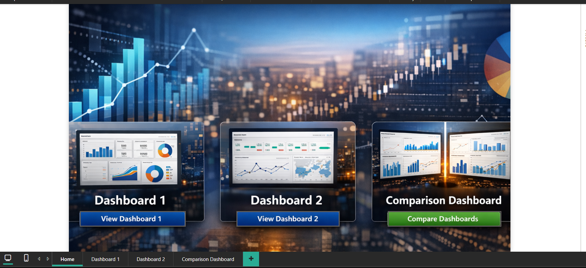
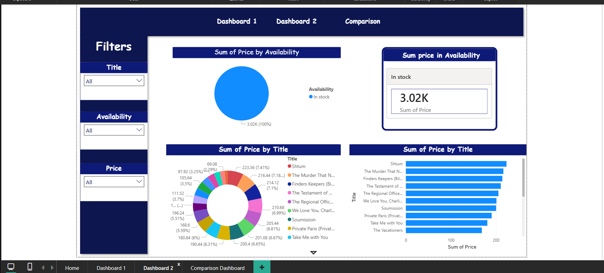
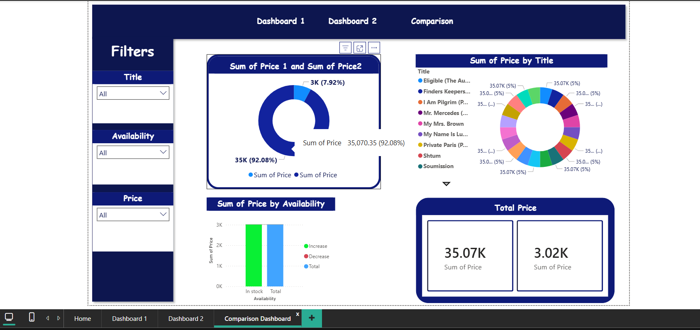
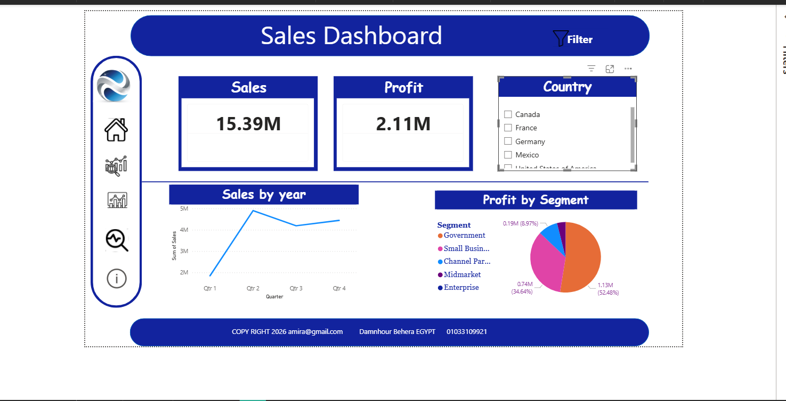

# DEPI-Initiative 📊

## Project Overview

This project is part of the **DEPI Initiative** and focuses on analyzing **financial data** using Microsoft Power BI.
The purpose of this project is to explore financial performance, identify trends, and present insights through interactive dashboards.

## Tools & Technologies

* Microsoft Power BI
* Microsoft Excel
* DAX (Data Analysis Expressions)

## Dataset

The dataset contains financial information such as:

* Sales
* Profit
* Cost of Goods Sold (COGS)
* Products
* Countries
* Year

## Dashboard Insights

The Power BI dashboard helps to:

* Analyze total sales and profit
* Compare product performance
* Identify the most profitable products
* Explore sales across different countries
* Track financial trends over time

## Project Screenshots

## Project Goals

* Understand financial performance
* Discover business insights
* Create interactive dashboards
* Practice data analysis using Power BI

## Author

**Amira Mariem**
Junior Data Analyst

LinkedIn:
https://www.linkedin.com/in/amira-mariem-445487202
# DEPI-Initiative
projects and training
